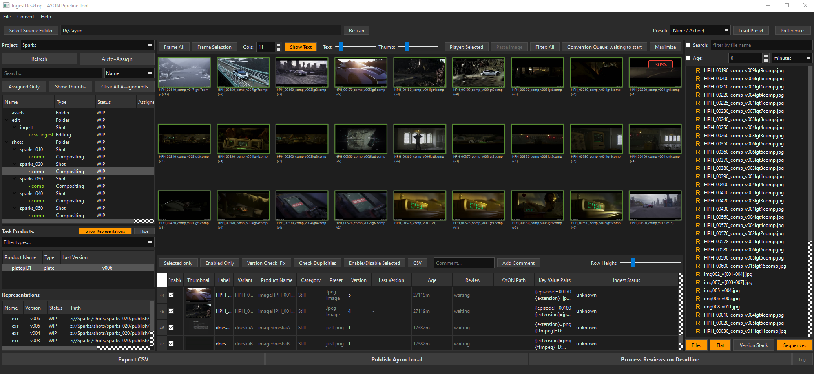

# **IngestDesktop**
Desktop application designed to catalog, validate, and ingest files to **AYON** pipeline.

---

## 🚀 Quickstart Guide

Get up and running with IngestDesktop in 9 simple steps.

### 1. Folder Scan
Use the **Top Bar** to browse or drag & drop a local directory path. IngestDesktop indexes the folder, categorizes files and populates the thumbnail grid, displaying widely supported image and video files right away. You can limit the files by text search or age filtering.
You can also just paste images from the clipboard: this mode saves the images to the temp folder; suitable for hunting references or working with cloud AI.

### 2. Metadata Extraction
IngestDesktop uses ffprobe to extract metadata like image resolution or timecode.

### 3. Conversions
IngestDesktop can be configured to do two conversions for every item found in the scanned folder. Thumbnail conversion produces still image. Review conversion typically produces lightweight video output like H264 in mp4 container. The Review conversions might be taxing, you can offload the processing to Deadline farm.
By default, IngestDesktop skips the processing of existing files. Video files playable by ffplay can be played directly at the Thumbnail view; use Play control toggle to play all, selected or no videos.

### 4. Assigning AYON Folder and Task
IngestDesktop connects to AYON server, and offers user to assign the folder & taks by doubleclicking item from the list. Another option relies on naming convention, you can use regular expressions to parse file names and auto assign AYON folder and task by name.
The AYON panel also shows list of produucts and thheir representations.

### 5. Assigning AYON Product Name from Label
IngestDesktop initially sets the label for each item as a file name stripped of version (and file counter in case the item is an image sequence). Thumbnnail view context menu or F2 hotkey offers many ways to rename the item labels.
Label is used to construct the AYON Product Name. Alternatively, user can assign already used product name pulled from AYON database by doubleclicking it.

### 6. Validating Versions
IngestDesktop parses the version from the file name, or assigns default v1. Version can be user edited in the Spreadsheet view. Version check is performed before sending files to AYON, or by user pressing the Version Check & Fix button.

### 7. Marking items for ingest
User can mark the items to be enabled or disabled, to control which items will be send to AYON. Hotkey Ctrl+D

### 8. Publish Files
Publish AYON local button creates CSV file for AYON Traypublisher, checks versions and duplicities, and publishes enabled items.

### 9. Log, Status change and Report after Publish.
After publishing, IngestDesktop reloads the AYON panel, and checks that every row in the CSV spreadsheet is present in the AYON database.
Cuccesful publishes are marked with green corner in the Thumbnail view and check mark in the File panel. There is also Ingest Status column in the Spreadsheet view.
The result is logged to CSV file. You can optionally set the status of the published version in AYON. Another feature is Neighbour Task Status: for example, after ingesting a CG render, you might want to set the compositing task status to "Ready to Start".
IngestDesktop can also generate simple PDF with ingest report.
