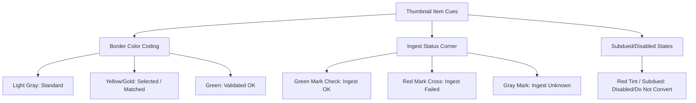

# IngestDesktop — System Reference Encyclopedia

This reference guide provides an exhaustive description of every interface panel, visual indicator, control button, and configuration setting available within **IngestDesktop**.

---

## 🎛️ 1. Workspace Panels Reference

### 🗺️ Top Bar (Navigation & Globals)
The control header at the very top of the application manages directory targets, scanning, and global timezones:
* **Source Folder input field**: Displays the currently scanned local or network directory path. Can be edited manually.
* **Browse button (`...`)**: Opens a native system folder dialog to select a source directory.
* **Rescan button (`F5` icon)**: Forces a full disk-level scan of the directory, rebuilding thumbnails, caches, and metadata indexes.
* **Clipboard Status indicator**: Displays state information when pasting clipboard imagery.
* **Timezone Markers**: Displays App Local Time A and Client Time B (derived via timezone offset configurations).

### 📁 Filter Panel (Left Navigation)
A collapsible sidebar designed to filter and isolate scanned directory assets:
* **Search input field**: Live-filters files dynamically as you type.
* **Age slider**: Filters files based on their last-modified age in minutes.
* **Hierarchy Folder Tree view**: Standard directory folder outline matching the disk structure.
* **Flat View list**: Replaces directory grouping with a unified, alphabetical flat list of all project files.
* **Toggle Buttons**:
  * *Files*: When checked, hides scene elements (backdrops, notes) showing only file elements.
  * *Flat*: Switches the model from folder tree hierarchy to flat listing.
  * *V-Stack*: When checked, collapses version folders to show only the highest parsed version.
  * *Sequences*: Identifies and collapses continuous image sequences into a single representative sequence asset with start/end frames noted.

### 🖼️ Thumbnail View (Graphics Scene)
A high-performance visual canvas displaying asset thumbnails, annotation backdrops, and video overlays:
* **Thumbnail Grid**: Renders cached thumbnails in a scalable layout.
* **Inline Editor**: Allows direct renaming of item labels inside the grid when edited.
* **Video Player Overlay**: Plays looping video reviews directly on top of selected card slots.
* **Backdrop items**: Resizable visual groupings used to group assets by task or priority.
* **Text Notes**: Annotation boxes placed in the scene to document progress or local instructions.

### 📊 Spreadsheet Panel (Table Sheet)
A structured spreadsheet layout detailing metadata, conversion tasks, and validation results:
* **File Name column**: Non-editable source filename.
* **Variant column**: Represents the target variant mapping (e.g. `comp`, `plate`, `render`). Double-click to manually edit.
* **Version column**: Numerical index of the version. Double-click to increment or edit.
* **Review Status column**: Reflects target transcodes (e.g., `waiting`, `processing`, `done`, `do not convert`).
* **Ingest Status column**: Displays validation state (`OK`, `Failed`, `unknown`).
* **Ingest Action column**: Dropdown configuring post-validation actions (e.g., `Publish`, `Ignore`).

### 🤖 AYON Panel (Auto-Assign Sidebar)
Manages database integrations, validation queries, and metadata mapping tasks:
* **Auto-Assign button**: Triggers template parsing using active regex pattern matching.
* **Check Version / Ingest Check button**: Runs validation routines to inspect directories, size flags, md5 hashes, and version conflicts.
* **Publish button**: Commits and registers successfully validated records into the active AYON database.

### 💬 Log Console Panel
Provides live telemetry, background task updates, and validation reports:
* **Logs view**: Renders stdout/stderr streams with color-coded categories (e.g., info, warning, error).
* **Toggle Logs button**: Collapses or expands the bottom console view.

---

## 🎨 2. Visual Orienting Cues & Color Codings

IngestDesktop uses high-contrast visual cues to help users orient themselves quickly:

### 🔲 Border Color Coding (Thumbnail Cards)
* **Light Gray (`#333333`)**: Standard idle card border.
* **Vibrant Yellow/Gold (`#ffaa00`)**: Indicates the item is currently selected, matched by filter queries, or playing reviews.
* **Green (`#4caf50`)**: Indicates the item has successfully passed Ingest Check validation with zero errors.

### 📐 Ingest Status Corner Indicators
Each thumbnail card features a colored corner badge representing its validation check status:
* **Green Check (`OK`)**: File is fully structured, hashed, and has passed all collision validations.
* **Red Cross (`Failed`)**: File contains layout, checksum, or version stack conflicts.
* **Gray Mark (`Unknown`)**: Pre-check status. Awaiting validation queries.

### 🔴 Disabled & Excluded Item Indicators
* **Red-Tinted Text / Labels**: Applied to rows, tree items, and thumbnail labels when set to `"do not convert"` or explicitly disabled from processing.
* **Semi-Transparent Cards**: Excluded thumbnail images are rendered with reduced opacity, making it easy to identify assets omitted from local review transcodes or Deadline submissions.

---

## ⚙️ 3. Preferences Dialog Configuration Reference

### 📁 General Tab
* **Create Ingest Report Checkbox**: Enables automated compilation of A4 Landscape PDF reports when validation finishes.
* **Timezone Offset A input**: Defines the UTC offset tag for the local capture environment.
* **Timezone Offset B input**: Defines the client's UTC offset, automatically generating shifted client-centric date strings on exports.
* **Default Columns Spinner**: Defines the column width grid alignment default for new scanning views.
* **Default Font Size Slider**: Configures scale margins for text metadata in the graphics scene.

### 🎬 Conversions Tab
* **FFmpeg Path field**: absolute file path to `ffmpeg.exe` binary.
* **FFprobe Path field**: absolute file path to `ffprobe.exe` binary.
* **OIIOTool Path field**: absolute file path to `oiiotool.exe` binary.
* **VFX Transcode Path field**: absolute file path to `vfxtranscode.exe` binary.
* **Browse buttons (`...`)**: Resolves binary targets using native file system explorers.

### 🤖 AYON Tab
* **AYON Server Address**: target database host URL.
* **API Token field**: Security validation token used to process database publishes.
* **Project Name**: Default scope context filter for database queries.

### 🚀 Deadline Tab
* **Job Name Template field**: Sets submission title variables (e.g. `"Encoding {label} Review for {ayon_path}"`).
* **Department field**: Pipeline department tagging (e.g. `"io"`).
* **Primary Pool**: Main task queue assignment target (e.g. `"all"`).
* **Secondary Pool**: Fallback queue (e.g. `"all"`).
* **Group**: Machine grouping target (e.g. `"2d_studio"`).
* **Priority**: Task submission ranking scale (default: `50`).
* **Machine Limit**: Maximum simultaneous nodes processing a single transcode job (default: `1`).
* **Concurrent Tasks**: Maximum parallel processes handled on a single render node (default: `1`).
